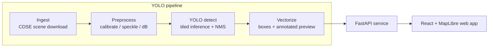

# Oil Spill Detection with YOLO (Sentinel-1 SAR)


YOLO-based oil-spill candidate detection on Sentinel-1 C-band SAR imagery, with
a pipeline that turns a raw Copernicus scene — or a single uploaded image —
into georeferenced oil candidates, served through a web API and an interactive
map UI.

Oil slicks dampen the sea surface and appear as dark patches in SAR backscatter.
The hard part is not seeing dark patches — it is telling **oil** apart from
**look-alikes** (low-wind zones, biogenic films, rain cells) that look almost
identical in a single SAR channel. This project treats every YOLO hit as an
**investigation candidate, not a confirmed spill**.

## Architecture



The same YOLO checkpoint backs single-image detection (`POST /yolo/detect`),
full-scene AOI jobs (`POST /jobs/scene`), and the `detect` CLI.

## Results

Detection performance is tracked with the YOLO training outputs under the
workspace-root `results/` directory (Ultralytics `yolo26m`, 1024px). See
[`docs/yolo_mvp.md`](docs/yolo_mvp.md) for the detector contract, the
unvalidated SAR-rendering assumption, and limitations.

## Quickstart

Requires [uv](https://docs.astral.sh/uv/) and GNU Make (backend) plus Node 20
(frontend).

```sh
cd oil-spill-detection
uv sync --extra yolo --group dev
```

```sh
make check
```

`make check` runs lint (ruff), the formatting check, type checking (pyright), and
the fast test suite.

### Run the app (native)

Start the backend (it defaults to the local `artifacts/yolo/best.pt` copy; override with an absolute path if yours lives elsewhere):

```sh
uv run python scripts/serve.py   # http://localhost:7860
# export OILSPILL_API_YOLO_WEIGHTS=/path/to/best.pt  # only if overriding
```

In a second terminal, start the frontend:

```sh
cd web
npm install
npm run dev                      # http://localhost:5173
```

The API also serves the built frontend from the same container:

```sh
docker compose up
```

Then open <http://localhost:7860>. The app starts without weights, but YOLO
endpoints return a clear 503 until `OILSPILL_API_YOLO_WEIGHTS` points at a
checkpoint (or `OILSPILL_YOLO_HF_REPO` fetches one at container startup — see
comments in [`compose.yaml`](compose.yaml)).

### Detect from the CLI

```sh
uv run python scripts/detect.py --safe path/to/S1.SAFE --weights /path/to/best.pt --out outputs/run1
uv run python scripts/detect.py --aoi aoi.geojson --start 2024-01-01 --end 2024-01-31 --out outputs/run1
```

## Limitations

- **Candidates, not confirmations.** YOLO is single-class (`oil`) and cannot
  distinguish look-alikes, ships, or land — every hit needs human review.
- **Unvalidated SAR rendering.** The dB-to-image window (`-25..0`) is a
  best-effort bridge between raw Sentinel-1 scenes and the YOLO training
  images; validate it before operational use.
- **Single polarization.** The pathway uses the VV channel only.
- **In-process scene jobs.** No queue/DB; job state is lost on restart.

## Documentation

- [`docs/yolo_mvp.md`](docs/yolo_mvp.md) — detector contract, configuration,
  and confidence heuristics.
- [`docs/hindcast.md`](docs/hindcast.md) — drift-backtrack input schema.
- [`docs/ARCHITECTURE.md`](docs/ARCHITECTURE.md) — package layout and pipeline
  stages (historical segmentation sections no longer apply).
- [`docs/legacy_content.md`](docs/legacy_content.md) — the original 2024
  project summary (historical reference).

## License

MIT — see [LICENSE](LICENSE).
