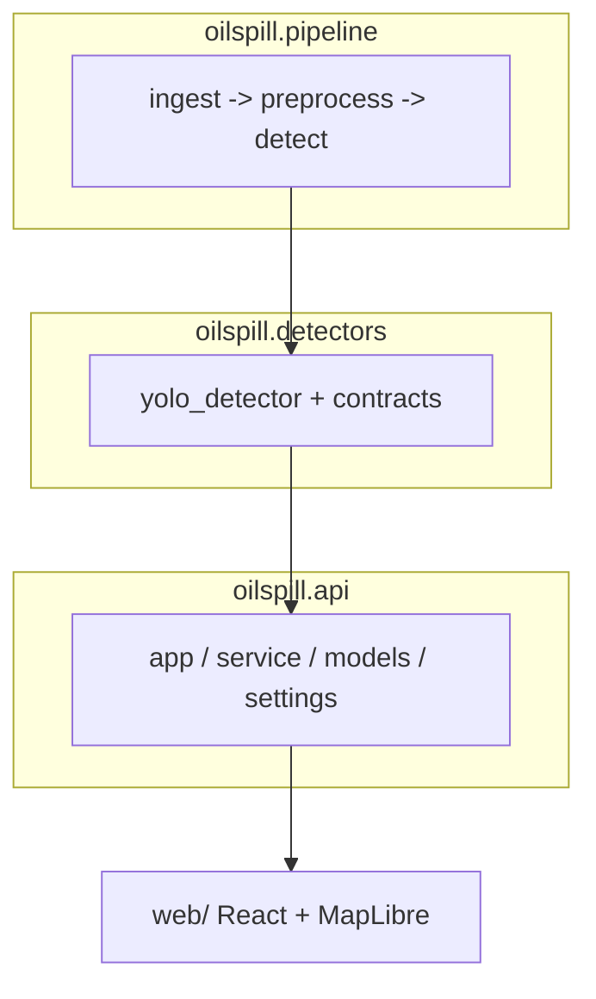

# Architecture

This document describes how the project is organized: the Python package layout,
the YOLO detection pathway, the Sentinel-1 pipeline, the inference/serving path,
and the CI story. It is intended to be accurate to the code in `src/oilspill/`
and `scripts/`.

The old five-class segmentation pipeline (training, evaluation, ONNX export)
was removed. `oilspill.models/`, `oilspill.training/`, `oilspill.evaluation/`,
`oilspill.packaging/`, and `oilspill.data/` remain only as stub skeletons.

## Overview

The system has one detector — an external Ultralytics YOLO one-class `oil`
checkpoint — fed by a Sentinel-1 preprocessing chain and served through FastAPI
plus a static web frontend:

1. **Scene intake** — search/download a Sentinel-1 scene from CDSE, or accept a
   single uploaded image.
2. **Detection** — render the scene to the YOLO uint8 image, run tiled YOLO
   inference with global NMS, and emit candidate boxes with an annotated
   preview.
3. **Serving** — the same detector backs single-image detection, full-scene AOI
   jobs, and the `detect` CLI.

## Package layout

The installable package lives under `src/oilspill/`:

| Module | Responsibility |
| --- | --- |
| `oilspill.detectors` | `yolo_detector.py` (SAR-to-YOLO rendering, tiled inference, global NMS, contour extraction, investigation-confidence heuristics) and `contracts.py` (shared `DetectionOutput` contract). |
| `oilspill.pipeline` | `ingest.py` (CDSE search/download), `preprocess.py` (VV calibration, Lee filter, dB conversion, land masks), `detect.py` (YOLO SAFE/AOI orchestration), `vectorize.py` (GeoTIFF/GeoJSON output helpers). |
| `oilspill.api` | The FastAPI application, request/response models, the YOLO service layer, and settings. |
| `oilspill.hindcast` | Drift-backtrack simulation (no fetching/forecasting). |
| `oilspill.models`, `oilspill.training`, `oilspill.evaluation`, `oilspill.packaging`, `oilspill.data` | Removed; stub skeletons only. |

CLI entry points in `scripts/` (`detect.py`, `serve.py`, `hindcast.py`,
`download_coastlines.py`) wire these modules to the command line.

## YOLO detection pathway

The YOLO path reuses CDSE ingestion and the SAFE calibration -> Lee filter ->
filtered-dB pipeline, then renders a detector-specific uint8 three-channel
image via `sar_to_yolo_image()` (linear dB window, default `-25..0` — an
**unvalidated assumption**, see [`yolo_mvp.md`](yolo_mvp.md)). It runs tiled
inference (`run_tiled_yolo`, default tile 1024 / overlap 128), remaps boxes to
scene pixels, merges with deterministic global NMS, and records tile
provenance. Its external checkpoint has one `oil` class only.

Single uploaded images (plain RGB chips, not calibrated SAR) skip the dB chain:
they are grayscaled directly to the YOLO rendering in `detect_yolo_image()`.

The frontend display path returns raw `[x1, y1, x2, y2]` bounding-box polygons
and an annotated inference image. The contour-extraction pipeline remains
available programmatically via `YoloDetector.detect()` (tagged
`derived_contour`/`approximate`, or `bbox_fallback`) but is not the primary
frontend result. Every hit is an **investigation candidate, never a confirmed
spill**; `investigation_confidence` is a heuristic, not a probability.

AIS ingestion, vessel reconstruction, environmental data retrieval, forward
drift, and suspect scoring are explicit non-goals.

## Inference and serving

The API (`oilspill.api`, FastAPI) exposes:

| Endpoint | Purpose |
| --- | --- |
| `GET /healthz` | Liveness probe. |
| `GET /samples`, `GET /samples/{name}` | Preloaded sample images (list + raw bytes). |
| `POST /yolo/detect` | YOLO candidate detection on one uploaded image. |
| `GET /yolo/status` | YOLO availability without leaking local paths. |
| `POST /jobs/scene` | Queue a full-scene YOLO AOI job (`detector=yolo_mvp` only). |
| `GET /jobs/{job_id}` | Poll a scene job. |
| `POST /hindcast` | Drift backtrack for one slick. |

Missing weights or a missing `ultralytics` install yields a clear 503. Scene
jobs run on FastAPI background tasks with an in-process store (no queue/DB;
state is lost on restart). When `web/dist` exists it is mounted at `/`, so the
API also serves the built frontend. The frontend (`web/`, React + Vite +
TypeScript + MapLibre) has **Quick Detect** (single-image YOLO + candidate
table), **Scene Monitor** (MapLibre AOI jobs + candidate boxes), **Hindcast**,
and **Overview**.

### Deployment

A multi-stage `Dockerfile` builds the frontend (`node`) and then a Python
runtime (the official `uv` image) that installs the serving dependencies plus
the `yolo` extra. The container listens on port 7860. YOLO weights are **not**
baked into the image: the entrypoint fetches them from the Hugging Face Hub at
startup when `OILSPILL_YOLO_HF_REPO` is set, and without them the API still
serves while YOLO endpoints return 503. `compose.yaml` runs the whole app
locally on <http://localhost:7860>.

## Reproducibility and CI

- **One-command checks.** `make check` runs ruff lint, the ruff formatting
  check, pyright type checking, and the fast (`not slow`) test suite with the
  coverage gate (≥80%).
- **Traceable detector.** YOLO training outputs live under workspace-root
  `results/`; the serving checkpoint is referenced by absolute path
  (`OILSPILL_API_YOLO_WEIGHTS`) and never committed.
- **Continuous integration.** The CI workflow runs the same `make check` gate
  plus a Docker build/start/healthcheck job, so lint, formatting, types, and
  tests are enforced on every change.
