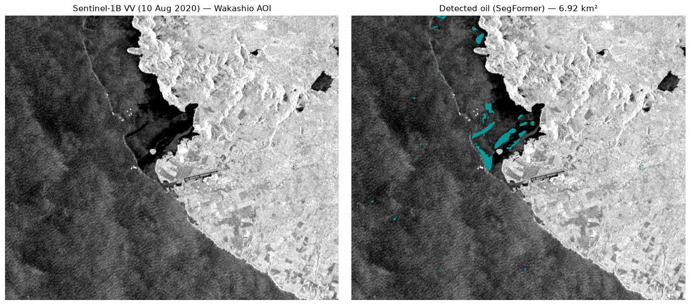

# Case study: MV Wakashio oil spill (Mauritius, August 2020)

This case study runs the end-to-end Sentinel-1 detection pipeline on a real,
documented oil-spill event and discusses the result honestly — including where the
detection is good and where it falls short.

> **Pipeline status (September 2026).** The production pathway is now the YOLO
> one-class `oil` candidate detector (`detector=yolo_mvp`, see
> `../yolo_mvp.md`). The SegFormer segmentation numbers and artifacts below are
> **legacy** — kept for provenance, produced by the retired five-class pipeline
> (`scripts/run_case_study.py` no longer exists). Do not compare YOLO candidate
> counts against the legacy polygon counts; they are different algorithms with
> different outputs (bounding-box candidates vs pixel masks).



*Left: Sentinel-1B VV backscatter (10 August 2020) over the spill area, south-east
Mauritius. Right: oil pixels detected by the retired SegFormer model (cyan).
Image kept as a historical reference.*

## The event (verified facts)

The bulk carrier **MV Wakashio** ran aground on a coral reef off **Pointe d'Esny,
south-east Mauritius** (~20.44° S, 57.74° E) on **25 July 2020** and began leaking
fuel oil on about **6 August 2020**, releasing roughly **1,000 tonnes of Very Low
Sulfur Fuel Oil (VLSFO)** before the vessel broke apart in mid-August. These
figures are from the International Maritime Organization and Cedre (see Sources).

The spill was independently mapped from space in the peer-reviewed literature.
Rajendran et al. (2021, *Environmental Pollution* 274) analysed Sentinel-1 VV
C-band SAR acquired between 5 July and 3 September 2020 and reported the oil
appearing as **dark warped patches**, with an overall SAR oil-spill mapping
accuracy of about **91.7 %** (Kappa 0.84). That study establishes both that
Sentinel-1 VV is an appropriate sensor for this event and what the spill looks
like in SAR.

> Note on quantitative comparison: we deliberately do **not** quote a single
> "official" spilled-area figure in km². A specific area value surfaced in
> secondary summaries could not be confirmed against the primary source, so it is
> excluded rather than cited unverified. Compare detections qualitatively
> (location, morphology, plausibility) against the published dark-patch mapping.

## Reproduce with the current YOLO pathway

No downloaded scene is committed (scenes are GB-scale and gitignored under
`data/scenes/`). You need CDSE credentials in `.env` (`CDSE_USER`/`CDSE_PASS`
account login preferred for downloads; see `.env.example`).

**Option A — Scene Monitor UI.** Open the frontend, set the AOI to the Pointe
d'Esny box and the date window below, then queue the job:

| Field | Value |
|---|---|
| AOI bbox (west, south, east, north) | `57.58, -20.52, 57.85, -20.32` (≈ 28 × 33 km) |
| Start | `2020-08-05` |
| End | `2020-08-15` (brackets the 10 Aug 2020 acquisition) |
| Detector | `yolo_mvp` (forced) |

Expect `queued → running` (scene download takes minutes) `→ done`, with
candidate boxes drawn on the map and a GeoJSON of `SPILL_xxx` features
(`spill_id`, WGS84 `latitude`/`longitude`, `model_confidence`,
`investigation_confidence`). YOLO hits are **investigation candidates, never
confirmed spills**.

**Option B — CLI** (same AOI as a GeoJSON file):

```sh
uv run python scripts/detect.py --aoi aoi-wakashio.geojson \
  --start 2020-08-05 --end 2020-08-15 \
  --weights artifacts/yolo/best.pt --out outputs/wakashio
```

The reference scene is `S1B_IW_GRDH_1SDV_20200810T013755_..._02B625`
(Sentinel-1B, IW GRDH, VV used), acquired **10 August 2020**.

**Continuing the demo story.** This event is wired into the prototype's
downstream defaults: the Hindcast page pre-fills the Wakashio slick
(`-20.44, 57.72`, `2020-07-25T04:35:00Z`, `3.1 km²`), and the deterministic
demo vessels/cases seed the same origin. A Scene Monitor candidate's lat/lon
feeds Hindcast → Vessels → Case → Report for the full investigation narrative.

## Legacy result (retired SegFormer pipeline, kept for provenance)

| Quantity | Value |
|---|---|
| Oil polygons detected (AOI) | 28 |
| Total detected oil area (AOI) | 6.92 km² |
| Mean polygon confidence | ~0.90 |
| Detection location | along the SE Mauritius coast / Blue Bay lagoon — consistent with the documented spill |

Machine-readable: `wakashio_summary.json` (legacy fields preserved; `status`
marks it as non-current). Geometries: `wakashio_oil_polygons.geojson`
(28 features with `area_km2`, `mean_confidence`, `max_confidence`).

The legacy discussion below is retained verbatim because its caveats
(uncalibrated radiometry, training-to-scene domain gap, approximate
GCP geolocation, coastal SAR complexity) apply equally to the YOLO pathway —
see also the dB-window validation warning in `../yolo_mvp.md`, which is the
current form of the domain-gap risk.

## Honest discussion of errors and limitations (retained)

The detected area should be read as a lower-bound, approximate figure, for several
documented reasons:

1. **Uncalibrated radiometry.** Full sigma-nought calibration via `xarray-sentinel`
   failed on this product (a library bug reading the product's GCP annotation), so
   the pipeline fell back to reading the raw measurement (digital-number
   amplitude → relative intensity). The decibel scale is therefore *relative*, and
   the normalisation window was fitted from scene percentiles rather than matched
   to the absolute statistics of the training data.
2. **Domain gap.** The model was trained on preprocessed 8-bit SAR chips, not on
   raw calibrated Sentinel-1 scenes. The appearance of oil (contrast, speckle,
   dynamic range) differs between the two domains; thin sheen and the faint edges
   of the slick are the first thing missed under this shift, which biases the
   measured area downward. For YOLO specifically, the `-25, 0` dB rendering window
   is the unvalidated bridge — flag any change there as risky.
3. **Geolocation is approximate.** Georeferencing uses an affine fitted to the
   product's ground-control points, which only approximates the true range/azimuth
   geometry of a GRD product (good to within a small number of pixels, not exact),
   so polygon areas carry a corresponding uncertainty. YOLO candidate polygons are
   additionally tagged `derived_contour`/`approximate` (or `bbox_fallback`).
4. **Coastal complexity.** The spill is nearshore and partly inside a lagoon, where
   land, surf, and shallow-water effects make SAR oil discrimination harder than in
   the open-ocean scenes the model was trained on. The YOLO detector mitigates
   with land-overlap penalties in its heuristic `investigation_confidence` — a
   ranking aid, not a probability.

## Sources

- International Maritime Organization — *Responding to MV Wakashio oil spill* (FAQ): https://www.imo.org/en/MediaCentre/HotTopics/Pages/Wakashio-FAQ.aspx
- Cedre — *Wakashio* spill page: https://wwz.cedre.fr/en/Resources/Spills/Spills/Wakashio
- Rajendran, S., Vethamony, P., Sadooni, F., Al-Kuwari, H., Al-Khayat, J., Seegobin, V., Govil, H., Nasir, S. (2021). *Detection of Wakashio oil spill off Mauritius using Sentinel-1 and 2 data: Capability of sensors, image transformation methods and mapping.* **Environmental Pollution, 274**, 116618. https://doi.org/10.1016/j.envpol.2021.116618
- Scene: Copernicus Data Space Ecosystem (Sentinel-1B, 10 August 2020). Contains modified Copernicus Sentinel data 2020.
